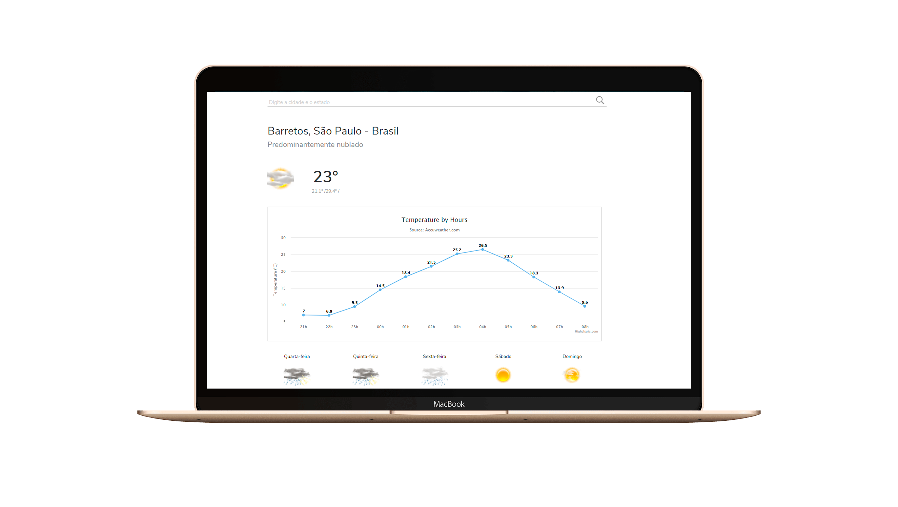

<h1 align="center">
    
</h1>

<h4 align="center">
   Get your 7-Day weather forescast for your city. 
</h4>

 

  

## 💻 Project

This project allow the user to see the 7-Day forecast for his current location or for other location, that can be set up by filling an search input.

## :rocket: Techs

- [HTML]
- [CSS]
- [Javascript]

---

☕ Glauber Brack
